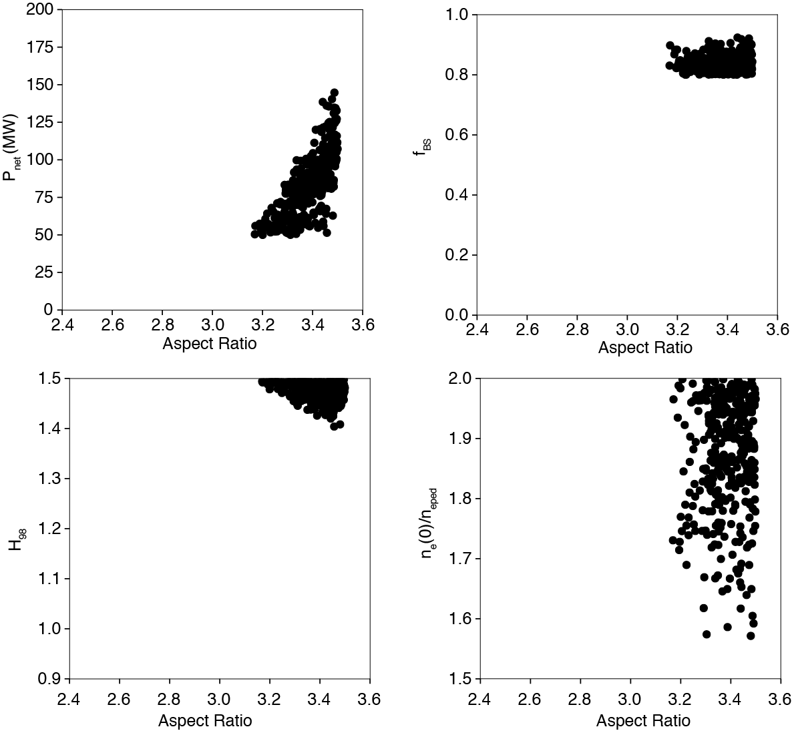

=========================
Evaluation and Filitering
=========================

This step illustrates how to evaluates the reactor performace parameters using the reduced system model developed in the previous section
and filter for the desired reactor performance.

Template
--------

`example4 <https://github.com/ORNL-Fusion/tokdesigner-doc/tree/main/examples/example4>`_

Evaulation
----------

This example uses the reduced model file ``fitout.json`` from the previous section for the ``fbs``, ``pfus``, and ``betan``.  The net electricity ``pnet`` model is a TokDiesigner ``base`` model.

**Command line**

.. code-block:: bash

  evaluate.py --input=evaluate.json --output=evaluate.dat --nsample=100000

The evaluate.py generates a database file ``evaluate.dat`` in a multi-dimensional parameter space of ``aratio``, ``pinj``, ``fgw_ped``, ``nepeak``, and ``h98`` for the ``--nsample`` random data points (100,000 points).

.. note::

   In this example, the range of the scan variables is same to the random sampling range for IPS-FASTRAN (:doc:`Scan with Random Sampling<scan_random>`).  The extrapolation outside of the model data generation range is often employed with the Log-linear model but not likely accurate for the Neural Network model.

**evaluaion.json**

.. code-block:: python

  {

  "scan": {
    "aratio"    : {"type": "range", "ymin":2.5, "ymax":3.5},
    "pinj"      : {"type": "range", "ymin":20.0, "ymax":50.0},
    "fgw_ped"   : {"type": "range", "ymin":0.7, "ymax":1.0},
    "nepeak"    : {"type": "range", "ymin":1.5, "ymax":2.0},
    "h98"       : {"type": "range", "ymin":0.9, "ymax":1.5}
  },

  "const": {
    "a"       : 1.3333,
    "kappa"   : 2.0,
    "delta"   : 0.6,
    "bt"      : 4.0,
    "ip"      : 8.1,
    "eta_cd"  : 0.25,
    "eta_th"  : 0.33
  },

 "model": {
    "r"          : ["expr", "a * aratio"                 ],
    "betan_ped"  : ["base", {}   ],
    "te_ped"     : ["base", {"dependency":"betan_ped"}   ],
    "ti_ped"     : ["expr", "te_ped"                     ],
    "ngw"        : ["base", {}                           ],
    "ne_ped"     : ["expr", "fgw_ped * ngw"              ],
    "ne_axis"    : ["expr", "nepeak * ne_ped"            ],
    "betan"      : ["file", "fitout.json" ],
    "pfus"       : ["file", "fitout.json" ],
    "fbs"        : ["file", "fitout.json" ],
    "pnet"       : ["base", {}]
  }

  }

The content and format of the input file ``evaluation.json`` is identical to the ``sample.json`` except without the ``io`` section (see :doc:`Scan with Random Sampling<scan_random>`).  Note that the ``model`` section for the ``betan``, ``pfus``, and ``fbs`` points to the reduced model file ``fitout.json``.

Filtering
---------

The process is same to the :doc:`Direct Filtering<scan_random>` but with the database file ``evaluation.dat`` generated by the reduced system model.

**Command line**

.. code-block:: bash

    filter.py --input=filter.json --dbfile=evaluation.dat --output=filter.dat

**filter.json**

.. code-block:: python

   {
   "filter": {
     "fbs"  : ["min", 0.8],
     "fbs"  : ["max", 1.0],
     "pnet" : ["min", 50.0]
   }
   }

This is an example for the bootstrap current ``0.8 <= fbs <= 1.0`` and the net electricity ``pnet >= 50 MW``. The output database file ``filter.dat`` contains the filtered points satisfying these constraints.

The indentified ``aratio`` range is ``aratio > 3.1`` for ``0.8 <= fbs <= 1.0`` and ``pnet >= 50 MW``, The results indicate that very high confinement ``h98 > 1.4`` is required, but not necessarily high density peaking.

.. warning::

  Many parameters in the scan in this example such as the toroidal field, current, minor radius etc are constant. The results should not read like higher `aratio` is better.

