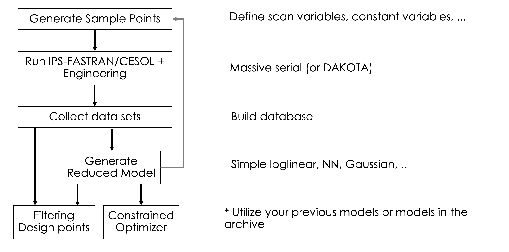

=================
TokDesigner Basic
=================

TokDesigner provides a set of flexible workflows to support various tasks in the reactor design process. The conceptual reactor design with TokDesigner is an iterative, recursive, refining process with the model hierarchy from the simple analytic descriptions to the state-of-art theory-based integrated modeling simulations.

Building Blocks
---------------

TokDesigner workflows consist of

#. :doc:`Generate sample points<sample>`
#. :doc:`Run IPS-FASTRAN/CESOL + Engineering components<run>`
#. :doc:`Build database<db>`
#. :doc:`Generate reduced model<ml>`
#. :doc:`Filtering design points<filter>`
#. :doc:`Constrained optimizer<optimizer>`

|

Workflows
---------

Typical TokDesigner workflows include

- Direct filtering: 1 → 2 → 3 → 5
- Filtering with reduced models: 1 → 2 → 3 → 4 →  5
- Constrained optimizer with reduced models : 1 → 2 → 3 → 4 → 6
- End-user / black-box application with the pre-developed reduced models : 5 or 6
- Evaluation of tokamak fusion performance for the existing design: 2

|

Advanced Workflows
------------------

- Adaptive sampling
- Advaced optimizer
